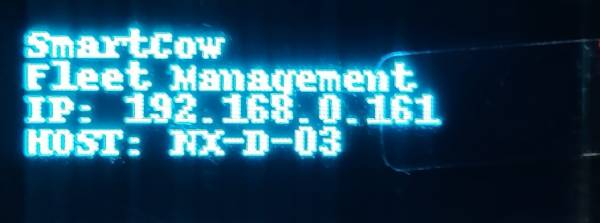

### Jetson OLED

A python wrapper to write text lines to oled screen on jetson.

**Installation**

````bash
sudo apt-get update -y && \
    sudo apt-get install -y python3-pip python-smbus i2c-tools python3-pil && \
    sudo -H pip3 install adafruit-circuitpython-ssd1306
````

**Run**

````
python3 run.py
````

**Output**

<table>
    
</table>


